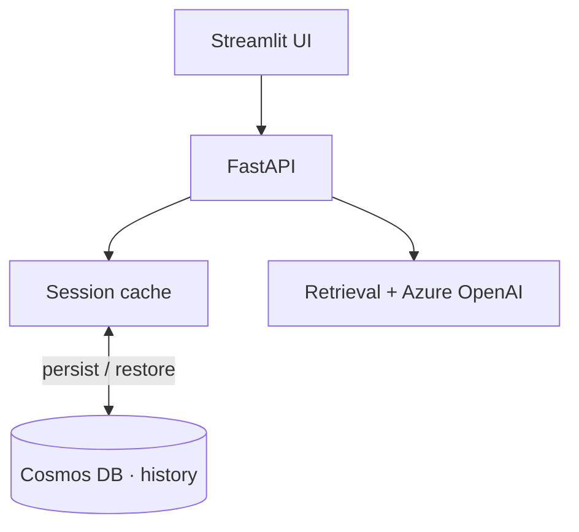

# Chatbot Conversation Memory — Cosmos DB + FastAPI

> A RAG chat backend focused on **conversation memory**: multi-turn history persisted in Azure Cosmos DB, with a warm in-process cache and graceful degraded mode when storage is unavailable.

  

## What this project is
The piece most RAG demos skip: **durable, multi-user conversation state**. It shows how to persist chat history, restore it on cold start, and keep serving when the store is down — the memory layer behind a real assistant.

## What it actually does (implemented)
- **Conversation persistence** in **Azure Cosmos DB** (create/list/rename/soft-delete).
- **Warm in-process cache** for active sessions; **cold-start restore** from Cosmos.
- **Degraded mode** — keeps answering (in-memory only) if Cosmos is unavailable.
- **Streaming RAG** (hybrid retrieval + Azure OpenAI) on the Microsoft Agent Framework.
- Per-user isolation; Streamlit front end.

## Architecture


## Run it
```bash
cp .env.example .env       # Azure OpenAI / AI Search / Cosmos values
pip install -r backend/requirements.txt
uvicorn app.main:app --reload
streamlit run frontend/app.py
```

---
